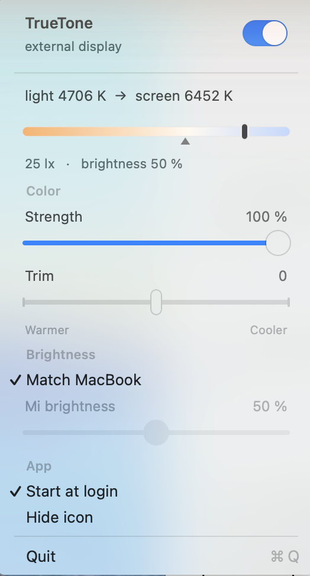

# TrueTone

Apple's **True Tone** shifts the built-in display's white point toward the colour
of the light in your room. Apple does not do this for external monitors.

TrueTone is a small macOS menu-bar app that does: it drives an external monitor's
white point from the MacBook's own ambient-light sensor, and syncs that monitor's
backlight to the MacBook's brightness keys over DDC/CI.



Backlight sync on its own is well covered by Lunar and MonitorControl. What this
adds is the colour half: the sensor's ambient **colour temperature** is read
directly from the HID event, and the per-channel gains are computed in the
panel's **own primaries**, taken from its EDID — not sRGB, which over-warms a
wide-gamut screen by a visible margin.

The menu bar carries a half-filled ring —  — struck through when something needs attention.

---

## Will this work for your setup?

Written and verified against exactly one pairing:

- **MacBook Air M3** (`Mac15,12`), macOS 15.7.2, Apple Silicon
- **Xiaomi Mi Monitor** over USB-C (DisplayPort Alt Mode)

It should run against any DDC-capable external monitor on an Apple Silicon Mac
that has an ambient-light sensor — the panel's primaries are read from its EDID
rather than hardcoded — but the adaptation curve was tuned by eye against this
one, and every hazard below is about this one.

It uses private Apple APIs and is neither signed nor notarised. It is not an App
Store app and is not trying to become one. Read the hazards before you run it.

---

## Read this first (hazards)

**A monitor's DDC controller can be wedged, and recovery is a power cycle.** On
this panel that meant unplugging it from the wall for 30 seconds. These rules
exist because of past incidents and are not negotiable:

- **Never write VCP `D6`** (`m1ddc set standby 4/5`). Hard-off powers the scaler
  down, the USB-C sink disappears, and nothing software can bring it back.
- **Never switch input away from the one carrying your picture** (USB-C, 16, on
  this setup). Parking on an empty input drops the link; macOS then has no
  display and DDC has no route home.
- **Never loop DDC.** Sustained set+get cycles wedge the MCU. Writes only, spaced
  out, and never a read immediately after a write (it returns an error value).
- **Share a lock with anything else that talks DDC.** Here the owner's shell
  hooks guard every DDC call with a `mkdir` mutex on `~/.monitor_hook.lock`
  (25 s staleness rule); `DDCBrightness` takes the same one and skips its write
  if the hooks hold it. If you run other DDC tools, make them agree on a lock.

**Do not trust old conclusions in git history.** One commit states the panel
rejects DDC brightness writes. It does not — that was a bug in a hand-rolled
I2C frame. Verify against hardware before building on any claim here.

---

## Install and control

**This is built for one specific pairing** — a MacBook Air M3 and a USB-C Xiaomi
Mi Monitor — and it reads that panel's own EDID primaries to get the colour
right. It will run against other DDC-capable monitors, but the tuning and the
hazard notes above are about this hardware. Read the hazards first.

Requirements:

```
xcode-select --install     # Swift toolchain
brew install m1ddc         # backlight control over DDC/CI — without it, colour only
```

```
scripts/install.sh      # release build → ~/Applications/TrueTone.app → LaunchAgent
scripts/uninstall.sh    # stop and remove everything
swift build && ./.build/debug/TrueTone     # run without installing
swift test                                  # pure maths, no hardware needed
```

`install.sh` writes `~/Library/LaunchAgents/com.dmitriy.truetone.plist`
(`RunAtLoad`, `KeepAlive` on crash only) and symlinks the `truetone` CLI into
`/usr/local/bin`. Prefs: `~/Library/Preferences/com.dmitriy.truetone.plist`.
Errors: `/tmp/truetone.log`. Env: `TRUETONE_DEBUG=1` (per-tick stderr),
`TRUETONE_FORCE_ON=1`.

> **Debug gotcha.** `.build/debug/TrueTone` is unbundled, so it reads the
> `TrueTone` defaults domain, *not* `com.dmitriy.truetone`. Verifying settings
> against the wrong domain has already caused one false bug hunt. Test with the
> installed `.app` binary.

Three ways in, because macOS Sequoia on this machine frequently refuses to draw
third-party menu-bar items at all:

- **Menu-bar icon** — a half-filled ring; struck through when something is wrong.
- **⌃⌥⌘T** — global hotkey (Carbon `RegisterEventHotKey`, no Accessibility need).
- **Re-open the app** from Finder / Launchpad — it is single-instance, so a second
  launch posts `com.dmitriy.truetone.reveal` and the running copy shows its menu.
- **`truetone`** — `show | hide | toggle | on | off | <0-100> | bright on|off|<0-100> | status`.
  Writes UserDefaults; `MenuBarController.reconcile()` picks changes up next tick.

If every third-party icon is missing (not just this one), that's the OS:

```
for i in $(seq 0 15); do defaults write com.apple.controlcenter "NSStatusItem Visible Item-$i" -bool true; done
killall ControlCenter
```

A menu-bar manager (Ice) is the durable fix.

---

## The menu

```
TrueTone                              [switch]
external display
⚠︎ <problem>                          (only when unhealthy)
light 4400 K  →  screen 6100 K
[■■■■▁▁▁▁▁]  warm↔cool scale, ▲ = room, ▮ = screen
190 lx · brightness 63 %
Color
  Strength      100 %                 how much of the adaptation to apply
  Trim              0                 manual ±1000 K bias, 50 K steps
  Warmer ———●——— Cooler               end labels, centred on the 0 knob
Brightness
  ✓ Match MacBook                     backlight follows F1/F2 over DDC
  Mi brightness  63 %                 manual level (disabled while matching)
  Reset brightness match              only once calibrated
App
  ✓ Start at login
  Hide icon
Quit
```

Custom rows must use `kMenuTextInset` (21 pt) so they line up with native items,
which indent past the checkmark column.

---

## How it works

Two timers: colour at **0.5 s**, brightness at **0.12 s** (brightness visibly
trailed the keys at 0.5 s; it only reads the built-in level, which is cheap).

| File | Role |
|---|---|
| `AmbientSensor` | lux + ambient CCT from the ALS HID event |
| `WhitePointModel` | ambient → target white point → per-channel gains |
| `PanelProfile` | the external panel's real primaries, from its EDID |
| `DisplayController` | writes gamma ramps; owns the display-reconfigure callback |
| `BuiltinBrightness` | reads the MacBook's brightness (the F1/F2 value) |
| `BrightnessMap` | built-in brightness → Mi luminance, via user anchors (pure) |
| `DDCBrightness` | backlight over DDC, via `m1ddc`; locking, rate limits, timeout |
| `MenuBarController` | the loop, the menu, health |
| `LoginItem`, `HotKey`, `Settings` | small support pieces |
| `Sources/ttprobe`, `Sources/ddcprobe` | hardware probes, dev tools — keep |

### Colour

Ambient CCT → partial adaptation from the panel's native white, in **mired**
space, scaled by light level, exponentially smoothed. Defaults are deliberately
gentle, like Apple: `maxAdapt 0.45`, `baseFrac 0.10`, `luxHigh 800` (full
strength only in bright light), `floor 4300 K`, `tau 6 s`.

`WhitePointModel.isReadingUsable` gates on **lux ≥ 4 and CCT ≥ 2500 K**; below
that the model parks at the native white point and the menu says "too dark": the sensor's colour output is meaningless in the dark
(it reads ~200 K) and adapting to it turned the screen orange.

Gains are computed in the panel's **own primaries**, read from EDID — not sRGB.
This monitor is wide-gamut (green at 0.2568 / 0.6748 against sRGB's 0.300 /
0.600), so sRGB maths cut green and blue harder than the target needed: the
screen ran warm by ~2 % at a 6000 K target and ~9 % at 4500 K. Its EDID white
point is genuinely D65 (6515 K), so *that* assumption was fine.

Gamma is colour-only. It is applied on top of whatever ramp is already loaded, so
an ICC calibration survives.

### Brightness

Real backlight over DDC/CI, not a gamma fake. `DDCBrightness` shells out to
**m1ddc** (`brew install m1ddc`, ~85 ms/write) because a hand-rolled
`IOAVServiceWriteI2C` path is silently ignored by this panel — reads work, writes
vanish. The bug was sending `0x51` both as the first payload byte and as the I2C
offset; even after fixing that the panel still only accepted m1ddc's framing, so
shelling out won over re-deriving the quirk.

`m1ddc` calls carry a **3 s timeout** — a wedged MCU makes it never return, and
without the timeout `readDataToEndOfFile()` blocks forever. All DDC work happens
off the main thread; `isAvailable` is cache-only and never probes.

**Calibration is implicit.** 1:1 (built-in 63 % → luminance 63) matches numbers
but not the eye — different peak nits, and macOS's slider is perceptual while DDC
luminance is a raw backlight scale. So: set the Mi by hand (dragging the slider
switches matching off by itself), then switch **Match MacBook** back on. That
records "at this MacBook level I wanted this much backlight". Do it again at a
clearly different level and the second anchor gives the slope — which is why
there are no min/max knobs. An explicit "Match now" button in a submenu was built
and removed: it opened onto one disabled row demanding you go turn something else
off first, and that precondition was invented anyway.

---

## Hardware findings

**Ambient sensor** — STMicro **VD6286** CRGB colour ALS (`AppleSPUVD6286`, driver
`com.apple.driver.AppleALSColorSensor`). Publishes a HID `AmbientLightSensor`
event (**type 12**) on a vendor page (`PrimaryUsagePage 0xFF00`, usage 4, SPU).
Unentitled, no TCC prompt:

```
client   = IOHIDEventSystemClientCreate(kCFAllocatorDefault)
           IOHIDEventSystemClientSetMatching(client, NULL)     // NULL = match all
services = IOHIDEventSystemClientCopyServices(client)
ev       = IOHIDServiceClientCopyEvent(svc, 12, 0, 0)          // the ALS one answers
value    = IOHIDEventGetFloatValue(ev, 0xC0000 + offset)
```

`+0x00` = lux, `+0x01…04` = raw channels, **`+0x0a` = CCT in Kelvin** — the clean
signal, and what the model uses.

**`+0x07` / `+0x08` are not chromaticity.** They track lux almost 1:1 (150 →
151.7, 317 → 320.6). Real x/y would need reverse-engineering the 193-byte
`CalibrationData` blob. This killed the idea of automatic tint correction.

`AppleSPUVD6286` also exposes `CurrentLux` as a plain ioreg property (lux only).

**Built-in brightness** — `DisplayServicesGetBrightness` works unentitled for the
built-in panel. It refuses the external one (`CanChangeBrightness` → 0), as does
`CoreDisplay_Display_SetUserBrightness`; DDC is the only route to the Mi.

**The built-in panel's own True Tone is invisible to us** — Apple applies it in
DCP, below CoreGraphics, so its gamma reads as identity. We can't mirror it; we
compute our own from the same sensor.

**m1ddc 1.2.0 segfaults on any `display` argument** — `display list` included —
as soon as a virtual display is attached; an iPad over Sidecar or Universal
Control is enough. Without a `display` selector it reads and writes the panel
fine, so `DDCBrightness` treats the index as a preference, not a requirement,
and falls back to the bare form. If your brightness control dies the moment you
plug in an iPad, this is why.

**Do not `dlopen` CoreBrightness in-process** — it destabilises the ObjC runtime.

---

## The recurring bug class

**Anything resolved once at launch breaks after sleep/wake or a late-appearing
display.** This has bitten three times: `PanelProfile`, the DDC display index,
and `AmbientSensor`'s HID service pointer. The LaunchAgent starts at login but
the Mi needs ~10 s after a wake (`~/.monitor_hook.log`: displaywakeup 14:27:27 →
ok 14:27:37), so a one-shot lookup silently leaves the app half-dead until the
next manual restart — colour falls back to sRGB maths, brightness sync stops.

Everything panel-dependent now: resolves on demand, latches **only on success**,
re-resolves from `CGDisplayRegisterReconfigurationCallback`, and retries from the
tick. `DisplayController.invalidateBaseline()` also drops cached base ramps, or a
sleep/reconnect could re-capture a base that already had our tint on it and
compound the shift every cycle.

If you add anything that reads the panel, follow the same pattern.

---

## Tests

`swift test` — pure maths only (`WhitePointModel`, `PanelProfile`,
`BrightnessMap`), no hardware. The point is regression cover: the colour path
shipped wrong **twice, silently**, and both failures are pinned.
`warmRoomWarmsTheScreenButOnlyPartway` catches the over-aggressive curve;
`wideGamutPanelNeedsLessCutThanSRGBMath` catches sRGB maths on this panel.

Colour bugs here do not crash — they just look slightly wrong. Add a test for
anything you change in the maths.

---

## State

**Verified on hardware:** DDC backlight (built-in 62.5 % → Mi 63), panel-primary
gains (B 0.958 → 0.974), lock cooperation (write skipped while held, applied on
release), late-resolution recovery (`origLum` — → 58), menu layout and English
strings, 32 tests.

**Written but never exercised:** the health/warning states (would need unplugging
the monitor or removing m1ddc), the sleep/wake re-resolution paths, sensor
re-creation, the struck-through icon in a live menu bar, and — most importantly —
**implicit brightness calibration**, the feature this was all for, which has
not yet been used in anger.

**Open, deliberately:** tint (green↔magenta) correction — the last real colour
gap, repeatedly offered and declined, and hard because the sensor doesn't expose
chromaticity.

**Known and unfixed, low priority:** `apply()` re-uploads the whole gamma table each
tick even when unchanged; `invalidateBaseline()` shows one untinted tick on
reconfigure; `reconcile()`'s `lastSynced*` start at defaults so the first tick
always reports a change; the single-instance check is theoretically racy.

---

## Layout

```
Sources/
  TrueTone/     the app
  ttprobe/      ambient sensor + display probe   (swift run ttprobe --watch 20)
  ddcprobe/     DDC + brightness-API probe       (swift run ddcprobe)
Tests/TrueToneTests/
scripts/        install.sh · uninstall.sh · truetone (CLI) · make-icon.swift
Resources/      Info.plist · AppIcon.icns
```
